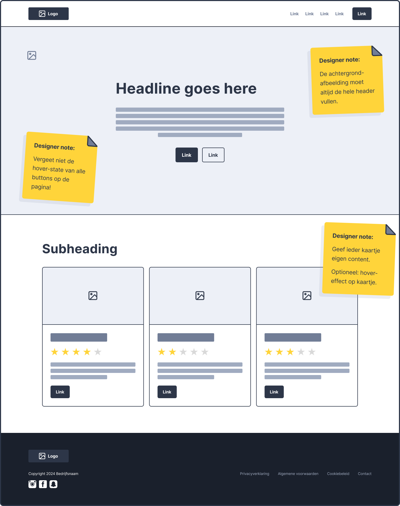
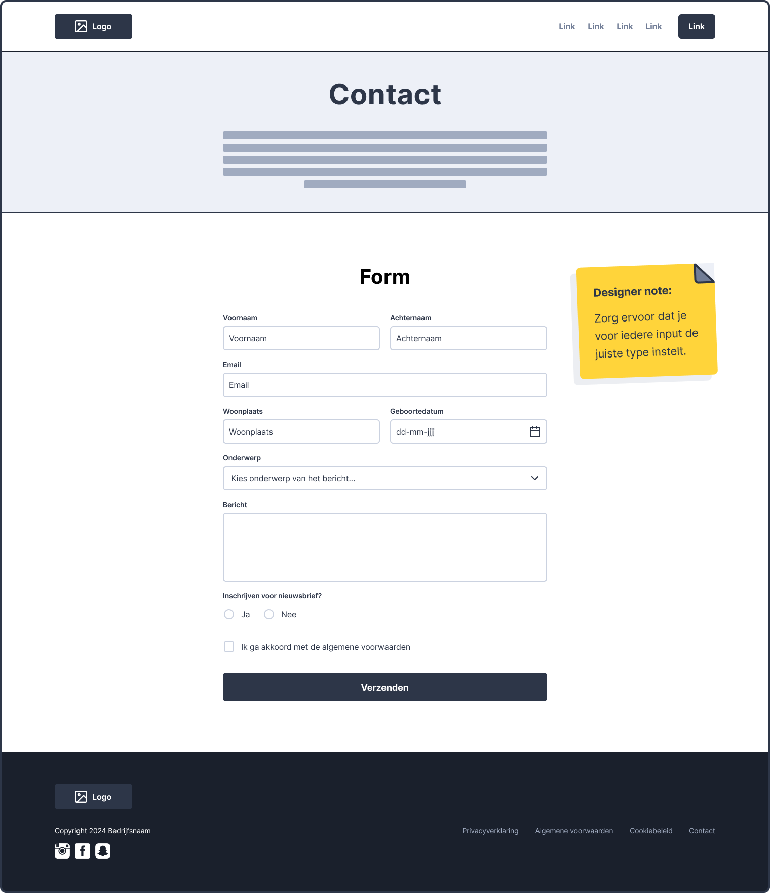
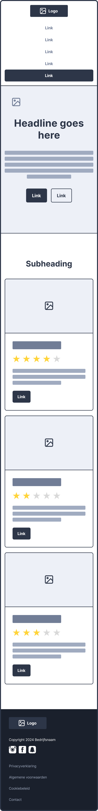
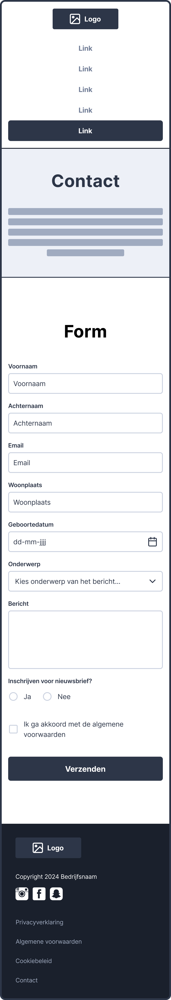

# Eindopdracht

**Inhoudsopgave**
- [Eindopdracht](#eindopdracht)
  - [De eindopdracht](#de-eindopdracht)
  - [Hulpbronnen](#hulpbronnen)
  - [Stap 1: Repository aanmaken](#stap-1-repository-aanmaken)
  - [Stap 2: GitHub Pages activeren](#stap-2-github-pages-activeren)
  - [Stap 3: Wireframes nabouwen](#stap-3-wireframes-nabouwen)
    - [Desktop wireframe - Home](#desktop-wireframe---home)
    - [Desktop wireframe - Contact](#desktop-wireframe---contact)
    - [Mobile wireframe - Home](#mobile-wireframe---home)
    - [Mobile wireframe - Contact](#mobile-wireframe---contact)

  

## De eindopdracht 

De informatie over de opdracht, het inleveren en de voorwaarden zijn te vinden in de cursushandleiding.
 
***Lees de cursushandleiding aandachtig door!***

 

## Hulpbronnen

Om jezelf nog verder te helpen volgen hier enkele hulpbronnen:
- Padding & margin
  - [Video: Margin and Padding Deep Dive: The basics](https://www.youtube.com/watch?v=EhbZGV2dqZ4)
- CSS Grid
  - [Documentatie op W3Schools](https://www.w3schools.com/css/css_grid.asp)
  - [Documentatie op Mozilla](https://developer.mozilla.org/en-US/docs/Web/CSS/CSS_grid_layout)
  - [Video waarin alle mogelijkheden worden getoond met demo's](https://youtu.be/EiNiSFIPIQE?si=3hd2dZh_BLXVhWhj)
  - [Spelletje om CSS grid te leren gebruiken](https://cssgridgarden.com/#nl)
- srcset
  - [Documentatie op Mozilla](https://developer.mozilla.org/en-US/docs/Learn/HTML/Multimedia_and_embedding/Responsive_images)
  - [Video met beknopte uitleg over srcset](https://www.youtube.com/watch?v=SyVKRnusyqM)
  - [Video met uitgebreide uitleg over srcset (aanrader!)](https://www.youtube.com/watch?v=2QYpkrX2N48)
- Semantische HTML
  - [Veelgebruikte semantische HTML-tags](https://www.w3schools.com/html/html5_semantic_elements.asp)
  - [Lijst met alle HTML-tags (alleen 
 en  zijn niet semantisch)](https://www.w3schools.com/TAGS/default.asp)

 

## Stap 1: Repository aanmaken

- Ga naar [github.com](https://www.github.com) en maak een nieuwe `repository` aan voor de eindopdracht;
  - Voer `repository name` in (*bv. frontend-eindopdracht*);
  - Zorg ervoor dat `Public` is aangevinkt;
  - De overige velden kan je voor nu ongewijzigd laten en klik op `Create repository`;

 

## Stap 2: GitHub Pages activeren
De volgende stappen zijn pas uit te voeren wanneer je al bestanden hebt om te uploaden.
- Klik op `uploading an existing file` om je `index.html`, en `style.css` te uploaden en klik vervolgens op `Commit changes`;
  - ⚠️ Let op: sleep de index.html en de css-map het scherm in, zodat de mappenstructuur behouden blijft;
- Activeer Github Pages (Settings -> Pages) door onder het kopje **Branch** de optie `main` te selecteren en vervolgens op `Save` te klikken;
- Refresh de instellingenpagina een paar minuten later en dan staat bovenin de link naar jouw website. **Dát is de link die je moet inleveren in [Brightspace](https://brightspace.hr.nl/d2l/le/lessons/28886/topics/187340)**;
  - ⚠️ Let op: doorloop bovenstaande stappen van het uploaden nogmaals vóórdat je het inlevert, zodat de meest recente bestanden online te zien zijn.

 

## Stap 3: Wireframes nabouwen
De opdracht is om onderstaande wireframes na te bouwen, zoals omschreven in de cursushandleiding.
Hieronder staan nog enkele tips om je hierbij te helpen.

> ### Tips voor het bouwen
>
> - Bouw eerst de basisstructuur op met `semantic` tags;
> - Bouw één voor één de rijen na, in plaats van alles tegelijk op te willen lossen;
> - Gebruik `display:flex` om elementen naast elkaar te zetten;
> - Hou de `flex-documentatie` bij de hand, en gebruik de `flex-inspector` in je browser.
> - Je mag `
` gebruiken om binnen sections containers aan te maken, wanneer je dit puur voor de styling nodig hebt;
> - Gebruik `padding` en `margin` om witruimte toe te voegen rondom je containers en binnen je containers
> - Je kan het **★** karakter gebruiken voor de "star ratings".
> - 😱 Als iets niet lukt, ga dan niet "*paniek-googlen*". Geef aan waar je op vastloopt bij je docent, medestudent of peercoach.

### Desktop wireframe - Home

[Download: Wireframe home - Desktop](https://github.com/HR-CMGT/frontend-2024-2025/files/15500304/wireframe-home-desktop.pdf)

### Desktop wireframe - Contact

[Download: Wireframe contact - Desktop](https://github.com/HR-CMGT/frontend-2024-2025/files/15500290/wireframe-contact-desktop.pdf)

 

### Mobile wireframe - Home

[Download: Wireframe home - Mobile](https://github.com/HR-CMGT/frontend-2024-2025/files/15500316/wireframe-home-mobile.pdf)

### Mobile wireframe - Contact

[Download: Wireframe contact - Mobile](https://github.com/HR-CMGT/frontend-2024-2025/files/15500326/wireframe-contact-mobile.pdf)

