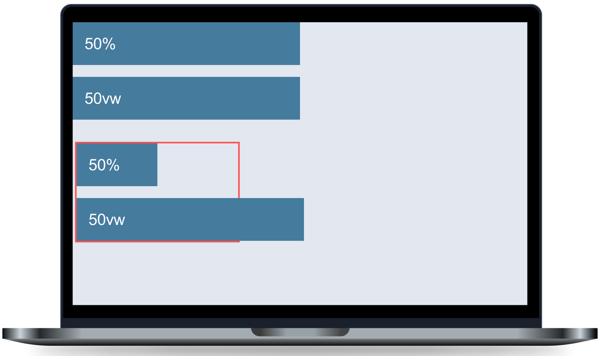

# Les 2 - Minipuzzels - Absolute & relatieve units

 

**Inhoudsopgave**
- [Les 2 - Minipuzzels - Absolute \& relatieve units](#les-2---minipuzzels---absolute--relatieve-units)
  - [Inleiding](#inleiding)
  - [Startcode downloaden](#startcode-downloaden)
    - [Hulpbronnen](#hulpbronnen)
  - [Minipuzzel 1](#minipuzzel-1)

 
 

## Inleiding
Voltooi onderstaande minipuzzels. Voor iedere oefening is er al code klaargezet in Brightspace die jij moet afronden. Let erop dat deze oefeningen alleen over CSS gaan. Dus je mag het HTML-bestand wel bekijken, maar schrijf alleen maar code in het CSS-bestand.

 

## Startcode downloaden

[Download de startcode uit Brightspace.](https://brightspace.hr.nl/d2l/le/lessons/110777/lessons/442865)

 

### Hulpbronnen
- ...

 
 

## Minipuzzel 1

Stel in de startcode balken in op de `width` zoals in onderstaande afbeelding wordt getoond. *(klik op de afbeelding om te vergroten)*.

Balk 1 en 2 hebben beiden even lang, terwijl de eerste met `%` is ingesteld en de tweede met `vw`. Hoe kan dit?
 
Dit komt omdat balk 1 en 2 direct in de `<body>` staan. Balk 1 is `50%z van de breedte van zijn parent

 
 

 

[Terug naar hoofdpagina](..)