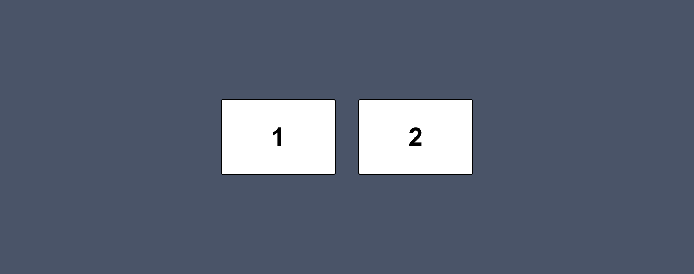

# Les 3 - Minipuzzels - Flexbox

 

**Inhoudsopgave**
- [Les 3 - Minipuzzels - Flexbox](#les-3---minipuzzels---flexbox)
  - [Inleiding](#inleiding)
  - [Minipuzzel 1](#mini-oefening-1)
  - [Minipuzzel 2](#mini-oefening-2)
  - [Minipuzzel 3](#mini-oefening-3)
  - [Minipuzzel 4](#mini-oefening-4)
  - [Minipuzzel 5](#mini-oefening-5)
  - [Minipuzzel 6](#mini-oefening-6)

   

## Inleiding
Voltooi onderstaande minipuzzels. Voor iedere oefening is er al code klaargezet die jij moet afronden. Let erop dat deze oefeningen alleen over CSS gaan. Dus je mag het HTML-bestand wel bekijken, maar schrijf alleen maar code in het CSS-bestand.

 

**Hulpbronnen voor de minipuzzels**

- [A Complete Guide to Flexbox](https://css-tricks.com/snippets/css/a-guide-to-flexbox/)
- [Flexbox cheatsheet](../../images/css-flexbox-poster.png) 
- [Video waarin flex-grow, flex-shrink en flex-basis wordt uitgelegd](https://www.youtube.com/watch?v=CFgeJq4l1YM)

   

## Minipuzzel 1

Bouw het volgende ontwerp na *(klik op de afbeelding om te vergroten)*:

   

## Minipuzzel 2

Bouw het volgende ontwerp na *(klik op de afbeelding om te vergroten)*:

   

## Minipuzzel 3

Bouw het volgende ontwerp na *(klik op de afbeelding om te vergroten)*:

   

## Minipuzzel 4

Bouw het volgende ontwerp na *(klik op de afbeelding om te vergroten)*:

   

## Minipuzzel 5

Bouw het volgende ontwerp na *(klik op de afbeelding om te vergroten)*:

   

## Minipuzzel 6

Bouw het volgende ontwerp na *(klik op de afbeelding om te vergroten)*:

 

[Terug naar hoofdpagina](../..)
