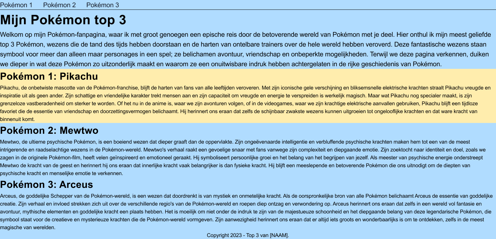
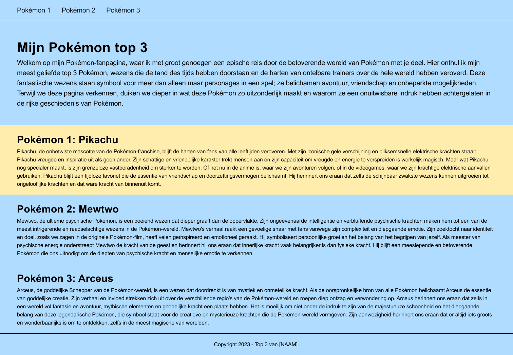
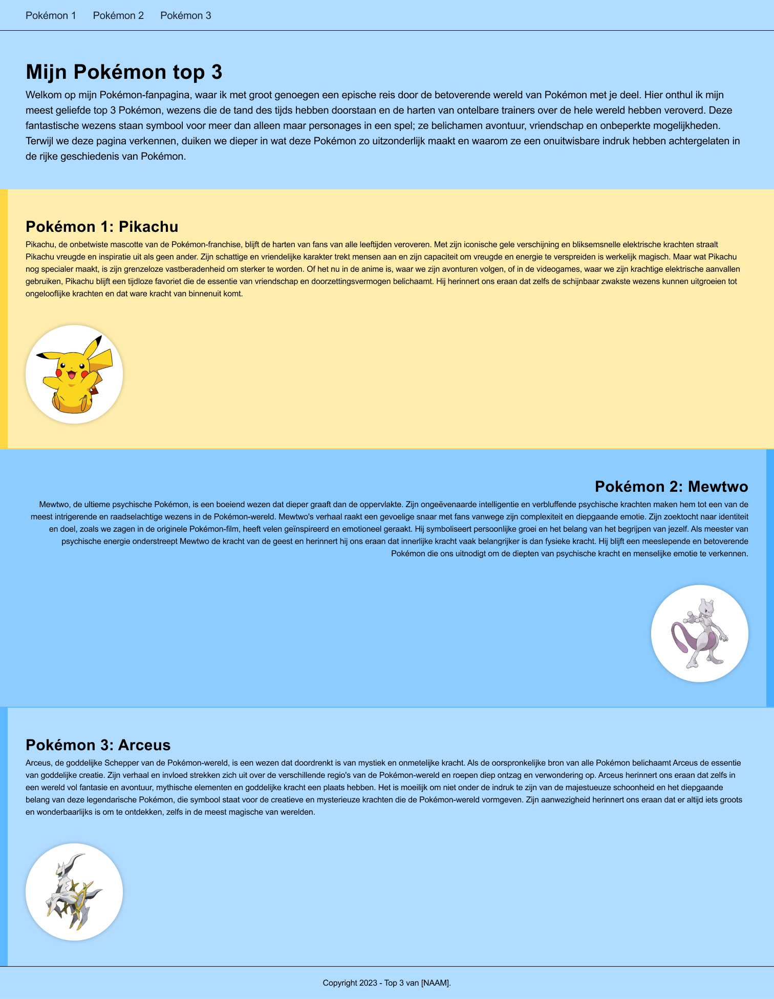
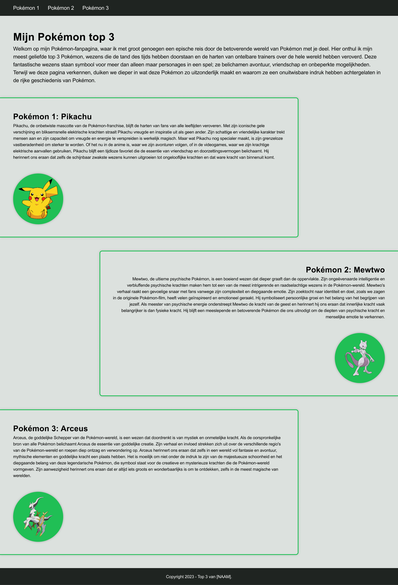

# Week 3 - Donderdag

<br>

**Inhoudsopgave**

- [Week 3 - Donderdag](#week-3---donderdag)
- [Inhoud](#inhoud)
    - [Semantische tags](#semantische-tags)
        - [Waarom semantische tags?](#waarom-semantische-tags)
        - [Semantische tags voor structuur](#semantische-tags-voor-structuur)
        - [Valkuil van semantische tags](#valkuil-van-semantische-tags)
    - [Werken met de inspector](#werken-met-de-inspector)
- [Quiz over semantische HTML-tags](#quiz-over-semantische-html-tags)
- [Oefenen met de inspector](#oefenen-met-de-inspector)
- [Mini-oefeningen - Padding \& margin](#mini-oefeningen---padding--margin)
- [Opdracht: Top 3](#opdracht-top-3)
    - [Opdracht 1 - Semantische HTML](#opdracht-1---semantische-html)
    - [Opdracht 2 - CSS: teksten en kleuren](#opdracht-2---css-teksten-en-kleuren)
    - [Opdracht 3 - CSS: padding \& margin](#opdracht-3---css-padding--margin)
    - [Opdracht 4a - BONUS](#opdracht-4a---bonus)
    - [Opdracht 4b - BONUS++](#opdracht-4b---bonus)

<br><hr><br>

# Inhoud

## Semantische tags

Er zijn in totaal meer dan 100 HTML-tags en slechts twee ervan zijn **niet** semantisch: `<div>` en `<span>`. Ze zeggen
namelijk niets over de soort inhoud die erin staat. Je mag ze dan ook alleen gebruiken wanneer je het puur nodig hebt
voor de styling van je pagina en er geen semantisch alternatief is.

<br>

### Waarom semantische tags?

Er zijn drie belangrijke redenen waarom je gebruik moet maken van semantische tags:

1. Toegankelijkheid: screenreaders kunnen zo de webpagina beter interpreteren, waardoor slechtzienden een betere
   ervaring hebben op jouw webpagina;
2. SEO: dit staat voor Search Engine Optimization, oftewel zo goed mogelijk gevonden worden door zoekmachines, zoals
   Google;
3. Leesbaarheid voor developers.

<br>

### Semantische tags voor structuur

Hieronder volgt een lijstje met semantische tags die je gebruikt om structuur aan de pagina te geven. Dit zijn niet alle
tags, maar wel de veel voorkomende.

| Tag         | Omschrijving                                                                                                                                                                                                                                                                                                                                                                                                                                                                                                                   |
|-------------|--------------------------------------------------------------------------------------------------------------------------------------------------------------------------------------------------------------------------------------------------------------------------------------------------------------------------------------------------------------------------------------------------------------------------------------------------------------------------------------------------------------------------------|
| `<header>`  | Definieert inhoud die moet worden beschouwd als de inleidende informatie van een pagina of sectie                                                                                                                                                                                                                                                                                                                                                                                                                              |
| `<nav>`     | Wordt gebruikt voor navigatielinks, oftewel het menu. Het kan worden geplaatst binnen de `<header>`, maar mag ook daarbuiten worden geplaatst. Nagenoeg iedere webpagina heeft een hoofdmenu, maar soms heb je ook een secundair menu, bijvoorbeeld in de `<footer>`                                                                                                                                                                                                                                                           |
| `<main>`    | Bevat de hoofdinhoud van een pagina. Hiervan mag er slechts één tag per pagina zijn.                                                                                                                                                                                                                                                                                                                                                                                                                                           |
| `<footer>`  | Je gebruikt `<footer>` altijd onderaan een pagina. Het is de afsluiter van de pagina en bevat meestal contactgegevens, copyrightinformatie en wat sitenavigatie.                                                                                                                                                                                                                                                                                                                                                               |
| `<section>` | Je gebruikt `<section>` om een webpagina op te splitsen in afzonderlijke secties met gerelateerde inhoud. Dus stel, je hebt een webpagina die gaat over jouw ervaring met een game, dan zou een sectie kunnen gaan over de graphics en een andere over de gameplay; twee verschillende onderwerpen, maar gerelateerd aan elkaar, omdat het over dezelfde game gaat.                                                                                                                                                            |
| `<article>` | In tegenstelling tot `<section>` gebruik je `<article>` om een op zichzelf staand stukje content weer te geven, die juist ***niet*** gerelateerd is aan het hoofdonderwerp. Het is bedoeld om onafhankelijk verspreid te kunnen worden door de website of herbruikbaar te zijn. Voorbeelden hiervan zijn: een forumbericht, een tijdschrift- of krantenartikel, of een blogbericht, een productkaart, een door een gebruiker ingediende opmerking, een interactieve widget of gadget, of enig ander onafhankelijk inhoudsitem. |
| `<aside>`   | Wordt gebruikt om content weer te geven die indirect gerelateerd is aan de hoofdinhoud van de `<section>` of `<article>`waarin die geplaatst is. Ook kan die daarbuiten worden geplaatst, bijvoorbeeld direct in de `<body>`, dan moet de content gerelateerd zijn aan de website zelf, bijvoorbeeld tweets van de auteur, aanvullende navigatie, laatste blogberichten, laatste opmerkingen, etc. Let op: de `<aside>` is iets anders dan een sidebar. [Lees meer](https://aastudio.fr/Sidebar-and-Aside-are-different.html)  |

> ⚠️ Let op: de tag `<div>` is dus ***niet*** semantisch. Je mag hem wel gebruiken binnen semantische tags
> als `<section>`, maar niet ter vervanging ervan.

<br>

### Valkuil van semantische tags

De grote valkuil van het gebruiken van semantische tags, is dat je ze gebruikt voor het uiterlijk dat ze standaard
hebben. Zo is een `<h1>` bijvoorbeeld standaard groter dan een `<h6>`, dus de valkuil is om de heading te gebruiken die
het meest
past bij het uiterlijk dat jij zoekt, maar dat is dus niet de bedoeling. Dus onthoudt:

> ⚠️ Je mag een tag *nooit* gebruiken, vanwege het standaard uiterlijk. ***Nooit!***

Wanneer mag je een tag dan wel gebruiken? Wanneer het de type content representeert die het moet zijn. Is het de
hoofdtitel? Dan gebruik je `<h1>`. Is het de titel daaronder? Dan gebruik je `<h2>`, etc.
<br><br>
De volgende twee tags worden ook vaak "misbruikt" vanwege het standaard uiterlijk die ze krijgen, maar gebruik ze dus
alleen voor de inhoudelijke waarde die het heeft.

| Tag        | Omschrijving                                                                                                                                                                                                                              | Voorbeeld in HTML                                                                                                                       | Eindresultaat                                                                                                 |
|------------|-------------------------------------------------------------------------------------------------------------------------------------------------------------------------------------------------------------------------------------------|-----------------------------------------------------------------------------------------------------------------------------------------|---------------------------------------------------------------------------------------------------------------|
| `<strong>` | Nadruk leggen op een gedeelte van de tekst, omdat deze belangrijk of urgent is.                                                                                                                                                           | `<p>`Voordat hij naar binnen ging, las hij de waarschuwing bij de ingang: `<strong>`Let op! Vuurspuwende draak verderop.`</strong></p>` | Voordat hij naar binnen ging, las hij de waarschuwing bij de ingang: **Let op! Vuurspuwende draak verderop.** |
| `<em>`     | Wanneer je op een gedeelte van de tekst verbaal de nadruk wilt leggen, vaak één woord. Deze is ook gebruikt in de waarschuwing die boven deze tabel is gegeven over dat je een tag *nooit* mag gebruiken vanwege het standaard uiterlijk. | `<p>`Dit zal `<em>` heel`</em>` erg gevaarlijk worden.`</p>`                                                                            | Dit zal *heel* erg gevaarlijk worden.                                                                         |

<br><hr><br>

## Werken met de inspector

- Open de inspector op een specifiek HTML-element door met de rechter muistoets op dat element te klikken en vervolgens
  op **Inspecteren** te klikken;
    - Ook is de inspector te openen met de sneltoets ⌥⌘i op Mac en F12 op Windows;
- Van het geselecteerde element zie je ook alle bijbehorende CSS staan. Deze CSS is in de inspector aan te passen en dit
  is dan direct zichtbaar in de browser. Zo kan je spelen met de waardes en real-time wijzingen zien om het ontwerp te
  bepalen. Dit noemen we `Designing in the browser`;
    - **Let op:** wanneer je CSS in de inspector wijzigt, verandert het ***niet*** in de bestanden in Visual Studio
      Code. Dit moet je handmatig wijzigen;


<br>

<br><hr><br>

# Quiz over semantische HTML-tags

[Klik hier om de quiz over semantische HTML-tags te doen](https://brightspace.hr.nl/d2l/le/lessons/28886/topics/192858)

<br><hr><br>

# Oefenen met de inspector

In het hoofdstuk [Werken met de inspector](#werken-met-de-inspector) heb je geleerd hoe je de inspector opent en
gebruikt. Nu wordt het tijd om deze te gaan gebruiken! Ga naar een website die jij vaak
bezoekt. Deze kan over jouw hobby gaan, maar het kan ook die van een supermarkt zijn, dat maakt niet uit. Open de
inspector en voer de volgende opdrachten daarin uit:

1. Pas van minimaal 3 teksten de kleur aan;
2. Pas van minimaal 3 teksten het lettertype aan;
3. Pas van minimaal 3 elementen de achtergrondkleur aan;
4. Pas de achtergrondkleur van de gehele webpagina aan;

<br><hr><br>

# Mini-oefeningen - Padding & margin

[Klik hier om de naar de mini-oefeningen te gaan.](./mini-oefeningen)

<br><hr><br>

# Opdracht: Top 3

## Opdracht 1 - Semantische HTML

Vorige les heb je een project aangemaakt voor dit vak, waarschijnlijk heb je deze `frontend-development` genoemd. Maak
hierin een nieuwe map aan met de naam `top3` (zonder spaties) en zet de basisstructuur neer, zoals uitgelegd
in [opdracht 1d van vorige les](../week3-dinsdag/#opdracht-1d---bestandsstructuur-html-en-css). De komende drie
opdrachten maak je in deze map, dus je breidt jouw webpagina met iedere opdracht uit.
<br><br>
Bouw vervolgens het volgende ontwerp na *(klik op de afbeelding om te vergroten)*.
<br>
Je mag je eigen top 3 bedenken, maar gebruik verder testteksten. De focus ligt in deze opdracht ***niet*** op de inhoud,
maar op de code.


<br>

Je hebt hier het volgende voor nodig:

| HTML    | CSS | Gebruikte kleuren |
|---------|-----|-------------------|
| header  | -   | -                 |
| main    |     |                   |
| footer  |     |                   |
| nav     |     |                   |
| section |     |                   |
| h1      |     |                   |
| h2      |     |                   |
| p       |     |                   |
| a       |     |                   |

<br>

**Hulpbronnen opdracht 1**

- [Instructie CMGT-dag over structuur aanbrengen](https://www.youtube.com/watch?v=h042V7L6NXM&t=160s) (*de video start
  op 02:40, bekijk tot 08:00, de rest is niet van toepassing voor deze opdracht*)
- [Cheatsheet HTML & CSS](../week3-dinsdag/cheatsheet/Cheatsheet-HTML-CSS.pdf)
- [Wireframe basisstructuur HTML](./images/Basisstructuur-HTML.jpg  )

<br><hr><br>

## Opdracht 2 - CSS: teksten en kleuren

Breidt jouw webpagina uit door het volgende ontwerp na te bouwen *(klik op de afbeelding om te vergroten)*.



  <br>

Je hebt hier het volgende voor nodig:

| HTML | CSS                    | Gebruikte kleuren |
|------|------------------------|-------------------|
| -    | Selectors o.b.v. tag   | #B0DCFF           |
|      | Selectors o.b.v. class | #FFEDAD           |
|      | font-family (Arial)    | #000000           |
|      | font-size              |                   |
|      | line-height            |                   |
|      | color                  |                   |
|      | background-color       |                   |
|      | border                 |                   |

<br>

**Hulpbronnen opdracht 2**

- [Cheatsheet HTML & CSS](../week3-dinsdag/cheatsheet/Cheatsheet-HTML-CSS.pdf)
- [Introductievideo CSS](https://www.youtube.com/watch?v=apC46Wfvd94 "Introductievideo CSS") (*bekijk tot 11:00, het
  deel erna is niet van toepassing voor dit vak*)

> ### Kleuren bepalen
>
>Elementen hebben een tekstkleur en een achtergrondkleur. Deze kan je op verschillende manieren bepalen:
>
>```css
>section {
>
>    /* Tekstkleur bepalen */
>    color: aliceblue;                               /* Kleur naam */
>    color: #FFFFFF;                                 /* Hexadecimale kleur */
>    color: rgb(255, 255, 255);                      /* RGB kleur */
>    color: rgba(255, 255, 255, 0.5);                /* RGB kleur met transparantie */
>
>    /* Achtergrond bepalen */
>    background-color: darkblue;                     /* Kleur naam */
>    background-color: #FFFFFF;                      /* Hexadecimale kleur */
>    background-color: rgb(255, 255, 255);           /* RGB kleur */
>    background-color: rgba(255, 255, 255, 0.5);     /* RGB kleur met >transparantie */
>}
>```

<br><hr><br>

## Opdracht 3 - CSS: padding & margin

Breidt jouw webpagina uit door het volgende ontwerp na te bouwen *(klik op de afbeelding om te vergroten)*.



<br>

Je hebt hier het volgende voor nodig:

| HTML | CSS        | Gebruikte kleuren |
|------|------------|-------------------|
| -    | padding    | -                 |
|      | margin     |                   |
|      | text-align |                   |

**Hulpbronnen opdracht 3**

- [Video met uitleg over padding & margin](https://www.youtube.com/watch?v=EhbZGV2dqZ4)

<br><hr><br>

## Opdracht 4a - BONUS

Wanneer je de vorige opdrachten hebt afgerond, breng dan extra styling toe aan jouw pagina door de volgende wireframe na
te bouwen. Hierbij krijg je op de kleurcodes na geen hints, dus je moet het zelf op het blote oog nabouwen. Je mag ook
je eigen kleuren kiezen!

> ⚠️ Kijk goed naar de details in het ontwerp en neem dit precies zo over.

De benodigde afbeeldingen staan in de map `week3-donderdag/resources`.



| HTML | CSS | Gebruikte kleuren |
|------|-----|-------------------|
| ???  | ??? | #B0DCFF           |
|      |     | #000000           |
|      |     | #FFEDAD           |
|      |     | #FFD745           |
|      |     | #49AFFF           |

<br><hr><br>

## Opdracht 4b - BONUS++

Ben je toe aan nog meer uitdaging? Bouw dan het volgende ontwerp na. Ook bij deze opdracht mag je zelf de kleuren
kiezen, of de kleuren gebruiken die hieronder staan.

> ⚠️ Kijk goed naar de details in het ontwerp en neem dit precies zo over.

De benodigde afbeeldingen staan in de map `week3-donderdag/resources`.



| HTML | CSS | Gebruikte kleuren |
|------|-----|-------------------|
| ???  | ??? | #DCE1DE           |
|      |     | #000000           |
|      |     | #1F2421           |
|      |     | #FFFFFF           |
|      |     | #20BF55           |