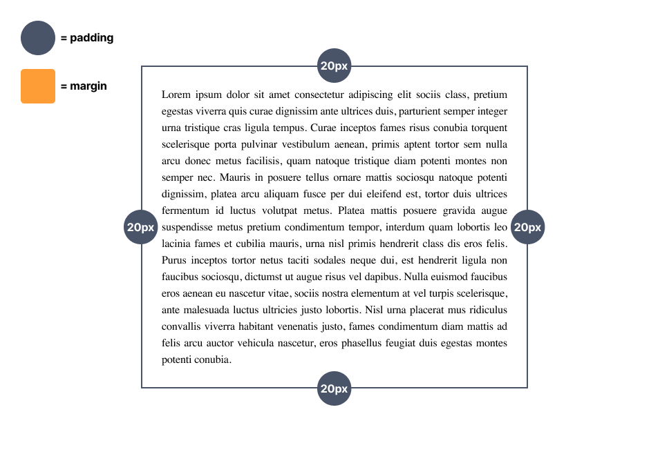
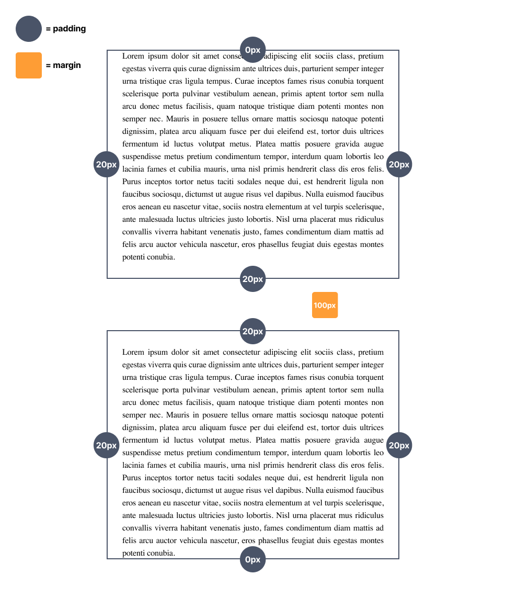
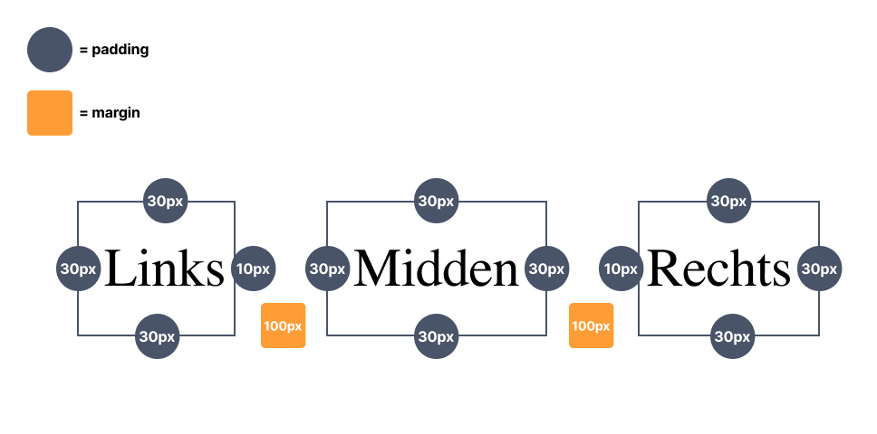
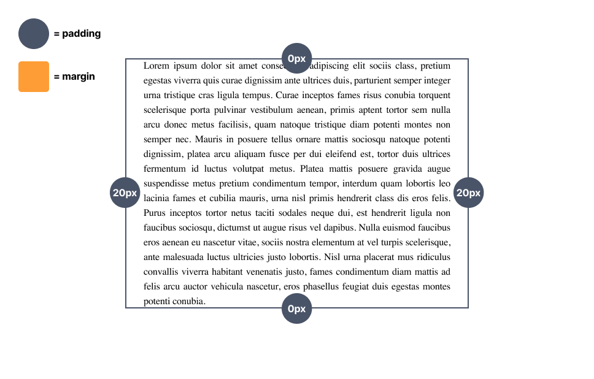
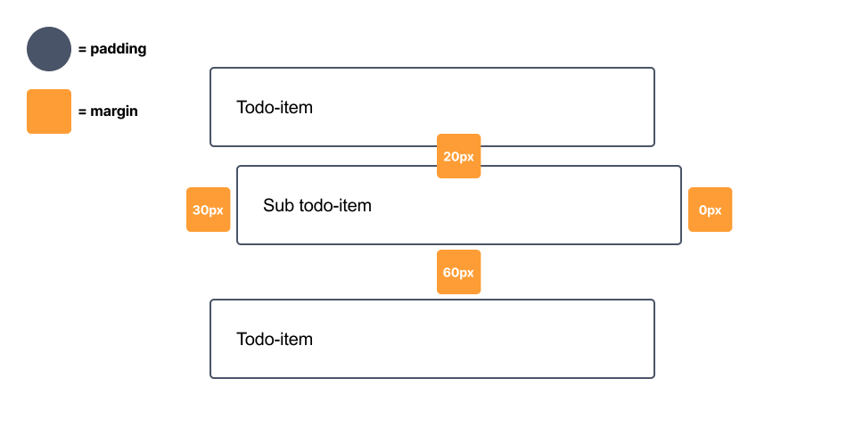
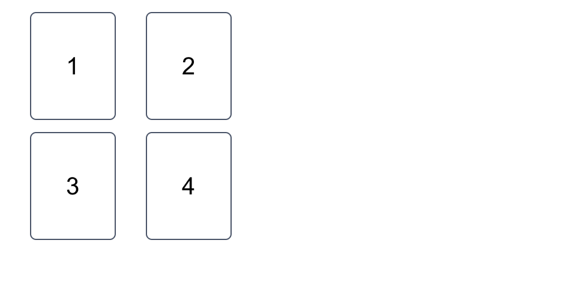

# Week 3 - Mini-oefeningen - Padding & margin

 

**Inhoudsopgave**
- [Week 3 - Mini-oefeningen - Padding \& margin](#week-3---mini-oefeningen---padding--margin)
  - [Inleiding](#inleiding)
    - [Hulpbronnen](#hulpbronnen)
  - [Mini-oefening 1](#mini-oefening-1)
  - [Mini-oefening 2](#mini-oefening-2)
  - [Mini-oefening 3](#mini-oefening-3)
  - [Mini-oefening 4](#mini-oefening-4)
  - [Mini-oefening 5](#mini-oefening-5)
  - [Mini-oefening 6](#mini-oefening-6)

 
 

## Inleiding
Voltooi onderstaande mini-oefeningen. Voor iedere oefening is er al code klaargezet die jij moet afronden. Let erop dat deze oefeningen alleen over CSS gaan. Dus je mag het HTML-bestand wel bekijken, maar schrijf alleen maar code in het CSS-bestand.

 

### Hulpbronnen
- [Documentatie padding](https://www.w3schools.com/css/css_padding.asp)
- [Documentatie margin](https://www.w3schools.com/css/css_margin.asp)

 
 

## Mini-oefening 1

Maak de code af door in de CSS `padding` toe te passen, zoals hieronder staat aangegeven *(klik op de afbeelding om te vergroten)*.

 
 

## Mini-oefening 2

Maak de code af door in de CSS `padding` en `margin` toe te passen, zoals hieronder staat aangegeven *(klik op de afbeelding om te vergroten)*. Ook heb je `selectors` nodig voor deze opdracht.

 
 

## Mini-oefening 3

Maak de code af door in de CSS `padding` en `margin` toe te passen, zoals hieronder staat aangegeven *(klik op de afbeelding om te vergroten)*. Ook heb je `selectors` nodig voor deze opdracht.

 
 

## Mini-oefening 4

Maak de code af door in de CSS `padding` toe te passen, zoals hieronder staat aangegeven *(klik op de afbeelding om te vergroten)*.
> **LET OP:** Je moet het met 1 regel code oplossen in het CSS-bestand.

 
 

## Mini-oefening 5

Maak de code af door in de CSS `margin` toe te passen, zoals hieronder staat aangegeven *(klik op de afbeelding om te vergroten)*.
> **LET OP:** Je moet het met 1 regel code oplossen in het CSS-bestand.

 
 

## Mini-oefening 6

Maak de code af door in de CSS `padding` en `margin` toe te passen, maar deze keer worden de waardes niet weergegeven in het ontwerp, die moet je *op het blote oog* proberen na te bootsen *(klik op de afbeelding om te vergroten)*.

 

[Terug naar hoofdpagina](../..)