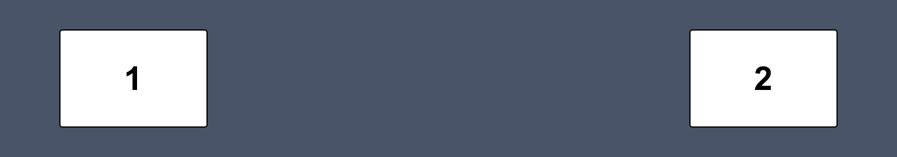
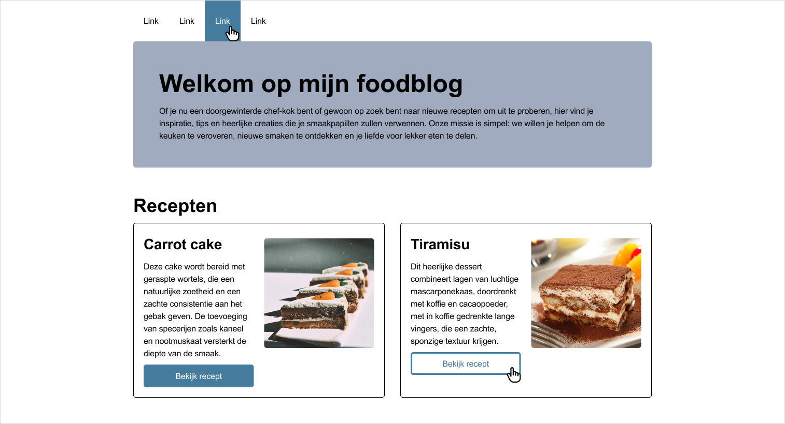
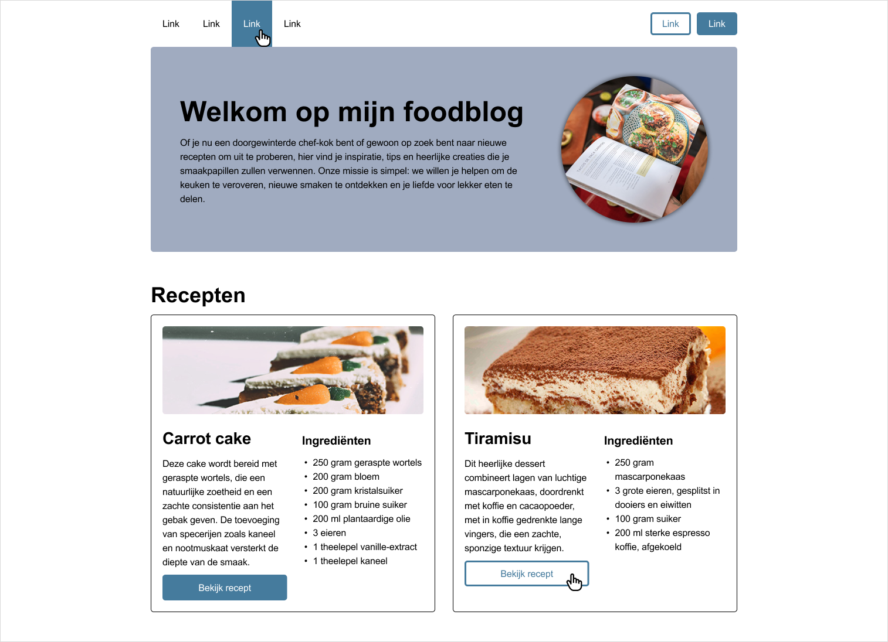

# Week 4 - Dinsdag

- [Week 4 - Dinsdag](#week-4---dinsdag)
- [Inhoud](#inhoud)
  - [Flexbox](#flexbox)
    - [Parent/child](#parentchild)
    - [Flexbox in een Flexbox](#flexbox-in-een-flexbox)
    - [Meest gebruikte Flexbox-opties](#meest-gebruikte-flexbox-opties)
    - [Flexbox-inspector 🔍](#flexbox-inspector-)
    - [Hulpbronnen voor Flexbox](#hulpbronnen-voor-flexbox)
  - [Navigatie](#navigatie)
    - [HTML voor de navigatie](#html-voor-de-navigatie)
    - [CSS voor de navigatie](#css-voor-de-navigatie)
- [Mini oefeningen - Flexbox](#mini-oefeningen---flexbox)
- [Mini oefeningen - Navigatie](#mini-oefeningen---navigatie)
- [Opdracht: Foodblog](#opdracht-foodblog)
  - [Advanced opdracht](#advanced-opdracht)

<br><hr><br>

# Inhoud

## Flexbox

In de afgelopen lessen heb je elementen alleen nog maar *onder elkaar* gezet. Wil je de mogelijkheid om elementen ook
*naast elkaar* te zetten? Dan kan je Flexbox gebruiken. Naast de mogelijkheid om elementen naast elkaar te zetten, krijg
je ook de mogelijkheid om de uitlijning van de elementen te bepalen. Kijk maar eens naar het volgende voorbeeld:


<br>
Met slechts 4 regels code van Flexbox krijg je het eindresultaat dat de drie elementen naast elkaar staan, dat er een ruimte tussen de elementen zit, dat ze als geheel de hele breedte vullen en dat element 1 dubbel zo groot is als element 2 en 3. Maar het volgende is bijvoorbeeld ook mogelijk:
<br><br>



<br>
Om dit eindresultaat te krijgen heb je zelfs maar 3 regels code van Flexbox nodig. Hopelijk krijg je hiermee al een eerste indruk wat de kracht van Flexbox is en dat je met weinig code totaal andere layouts kan maken dan je tot nu toe hebt gedaan.
<br>
Het is met Flexbox trouwens ook mogelijk om elementen weer onder elkaar te zetten met alle opties tot uitlijnen zoals je net hebt gelezen.

<br><br>

> Naast Flexbox heb je ook nog Grid. Deze techniek staat ook in de Export-kolom in het beoordelingsmodel. Wil je hier
> meer over weten? Zie de [hulpbronnen bij de eindopdracht](../eindopdracht/).

<br>

### Parent/child

Zoals gezegd kan je met een paar regels code al veel voor elkaar krijgen met Flexbox, maar je moet wel eerst weten hoe
het werkt. Het begint met een HTML-tag instellen als Flexbox. Al zijn directe *children* kunnen vervolgens naar wens
worden ingesteld met de Flexbox-opties. Zie de afbeelding hieronder. Links in de afbeelding zie je de code die we voor
dit voorbeeld gebruiken: de `<main>` met daarin drie keer een `<section>`. In HTML-termen spreken we er nu van dat
de `<main>` de *parent* is en de drie keer `<section>` die erin staan de *children*. Aan de rechterkant van onderstaande
afbeelding zie je deze parent/child relatie ook nog eens met kleuren uitgebeeld.

> De termen *parent* en *children* komen vaak terug bij HTML, dus onthoudt ze goed!


### Flexbox in een Flexbox

Let erop dat in bovenstaand voorbeeld alleen de `<main>` een Flexbox is en dus alleen de drie keer `<section>` kunnen
worden vormgegeven met Flexbox. Dus stel, in de tweede `<section>` staat ook inhoud die je met Flexbox wil vormgeven,
dan stel je die `<section>` ook simpelweg in als Flexbox en dan heb je ook weer alle mogelijkheden. Zo krijg je dus een
Flexbox, in een Flexbox, in een Flexbox, etc. Dit is goed! We raden aan om zoveel mogelijk Flexbox te gebruiken om je
layout te bepalen.

<br>

### Meest gebruikte Flexbox-opties

De Flexbox-opties zijn in te delen in twee categorieën: *parent-opties* en *child-opties*. Zoals de naam al
verraad
stel je de parent-opties in op de parent en heeft invloed op **alle** children. De child-opties stel je op de children zelf
in en heeft alleen invloed op de children waarop je het instelt.

<br>

**Flexbox-opties parent**

| Optie           | Omschrijving                                                                                                                               |
| --------------- | ------------------------------------------------------------------------------------------------------------------------------------------ |
| display: flex;  | Hiermee stel je een HTML-tag in als Flexbox.                                                                                               |
| flex-direction  | Instellen of de children in een rij of kolom getoond moeten worden.                                                                        |
| justify-content | Bepaalt de uitlijning op de hoofdas (dus de richting die gekozen is bij flex-direction).                                                   |
| align-items     | Bepaalt de uitlijning op de dwars-as (dus het tegenovergestelde van wat gekozen is bij flex-direction).                                    |
| flex-wrap       | Bepaalt of de Flexbox op één rij moet blijven, of zich mag verdelen over meerdere rijen.                                                   |
| align-content   | Wanneer flex-wrap op `wrap` staat en de content valt over meerdere rijen, is met deze optie de uitlijning tussen deze rijen in te stellen. |
| gap             | Bepaalt de ruimte tussen de children.                                                                                                      |

<br>

**Flexbox-opties child**

| Optie       | Omschrijving                                                                                         |
| ----------- | ---------------------------------------------------------------------------------------------------- |
| flex-grow   | Bepaalt hoeveel deze child mag groeien t.o.v. de andere children.                                    |
| flex-shrink | Bepaalt hoeveel deze child mag krimpen t.o.v. de andere children.                                    |
| flex-basis  | Bepaalt de standaardgrootte van de child voordat de resterende ruimte wordt verdeeld.                |
| flex        | Dit is de shorthand-notatie van bovenstaande drie opties. Het wordt aangeraden om deze te gebruiken. |
| align-self  | Deze optie werkt dezelfde als align-items, maar wordt hier alleen toegepast op de specifieke child.  |

Voor het volledige overzicht, [zie deze documentatie](https://css-tricks.com/snippets/css/a-guide-to-flexbox/#aa-flexbox-properties).

<br>

### Flexbox-inspector 🔍

Om erachter te komen wat er allemaal mogelijk is met Flexbox gebruik je de `inspector`. Hierin kun je namelijk met
simpelweg drukken op knopjes veel parent-opties uitproberen. Inspecteer een HTML-tag die staat ingesteld als Flexbox en
klik rechts van `display: flex` op het Flexbox-knopje. Voor meer info, bekijk de volgende
video: https://developer.chrome.com/docs/devtools/css/flexbox/


<br>

> Reminder: je opent de inspector door met de rechter muistoets op een specifiek HTML-element te klikken en vervolgens
> op **Inspecteren**, óf met de sneltoets ⌥⌘i op Mac en F12 op Windows.

<br>

### Hulpbronnen voor Flexbox

- [A Complete Guide to Flexbox](https://css-tricks.com/snippets/css/a-guide-to-flexbox/)
- [Flexbox cheatsheet](./images/css-flexbox-poster.png)<br>
- [Video waarin flex-grow, flex-shrink en flex-basis wordt uitgelegd met voorbeelden](https://www.youtube.com/watch?v=CFgeJq4l1YM)

<br><hr><br>

## Navigatie

In de vorige lessen heb je al vaker met `<nav>` gewerkt en in deze les duiken we daar dieper op in. Je weet al dat je in de `<nav>` een `<a>` invoert voer ieder linkje die je wilt tonen. Maar hoe stel je dit linkje correct in? En hoe kan je deze vormgeven? Dat leer je in deze les.

<br>

### HTML voor de navigatie

Allereerst: wat is een `<a>` eigenlijk? Het doel van deze HTML-tag is dat de gebruiker erop kan klikken en dat die naar een ander stukje content wordt gebracht. Dus stel, je bent op webshop en je wilt alle producten bekijken, dan klik je in het hoofdmenu (wat dus een `<nav>` is) op het linkje *Producten*, zodat je naar die betreffende pagina wordt gebracht.

De HTML van een navigatie ziet er doorgaans ongeveer als volgt uit:

```html
<nav>
  <a href="#">Link 1</a>
  <a href="#">Link 2</a>
  <a href="#">Link 3</a>
</nav>
```

Je begint met de `<nav>` met daarin één of meerdere `<a>`. Tot zover niets nieuws, dit heb je al meerdere malen gemaakt. Je ziet bij het attribuut `href` nu een `#` staan in dit voorbeeld. Op die plek komt de daadwerkelijke link te staan waarnaar genavigeerd moet worden. Dus waar de gebruiker naartoe moet wanneer die op de `<a>` klikt. Hiervoor heb je twee opties die hieronder worden toegelicht.

<br>

**Linken binnen dezelfde pagina**
<br>
Het is mogelijk om te linken naar een onderdeel op dezelfde pagina. Dus stel, er staan drie secties op jouw pagina, dan zou je in de navigatie per sectie een `<a>` in de `<nav>` kunnen plaatsen. Dit is vooral handig bij hele lange pagina's, zodat je gemakkelijk van de ene sectie naar de andere kan klikken. Een voorbeeld van de code hiervoor vind je terug in de [Cheatsheet HTML & CSS](../week3-dinsdag/cheatsheet/Cheatsheet-HTML-CSS.pdf) op pagina 2.

<br>

**Linken naar een andere pagina**
<br>
Wanneer je klikt wordt er een hele andere pagina geopend. Dit kan een pagina van dezelfde website zijn, maar ook van een andere. De meeste websites bevatten meerdere pagina's. Zo heb je bijvoorbeeld vaak een homepage, een over-ons-pagina en een contactpagina. De navigatie voor een website met deze drie pagina's zou er als volgt uit kunnen zien:

```html
<nav>
  <a href="index.html">Home</a>
  <a href="over-ons.html">Over ons</a>
  <a href="contact.html">Contact</a>
</nav>
```

Hier zie je dat bijvoorbeeld bij het linkje naar de contactpagina de `href` staat ingesteld op `contact.html`. Dit betekent dat er in jouw project ook een bestandje staat die `contact.html` heet en die wordt dan geopend wanneer je op het linkje klikt.

Bij het linkje voor de homepage zie je in de `href` overigens `index.html` staan, hierin staat namelijk de homepage.

Tot slot, wanneer je een link wilt leggen naar een andere website, dan moet je de volledige URL invoeren, dus vanaf `https://`. Ook raden we aan om deze *externe link* in een nieuw tabje te openen, zodat jouw eigen website ook nog in een tabje open blijft staan. Dit stel je in met het attribuut `target` en de waarde moet dan `_blank` zijn. Dus stel, de link moet naar Google, dan zou dat er als volgt uitzien:

```html
<a href="https://www.google.com/" target="_blank">Google</a>
```


<br>

### CSS voor de navigatie

Het vormgeven van de `<nav>` werkt zoals met iedere andere HTML-tag, maar de `<a>` heeft enkele uitzonderingen die hier worden uitgelegd. Het is namelijk belangrijk om te weten dat een `<a>` verschillende *states* heeft. Dit betekent dat je afhankelijk van de situatie de `<a>` een andere styling kan geven. Het gaat om de volgende states:

- Standaard: de normale state wanneer geen andere van toepassing is;
- visited: wanneer de link al eerder aangeklikt is;
- hover: wanneer de muisaanwijzer op de link is geplaatst (zonder te klikken);
- active: tijdens het klikken op de link;
- focus: wanneer de focus op het linkje staat, meestal doordat je met de tabtoets door de pagina heen gaat.

Bovenstaande states kun je in de CSS selecteren door het gebruik van zogenaamde *pseudo-classes*. Deze classes hoef je niet handmatig in de HTML in te voeren, maar krijgt de HTML-tag vanzelf. Meer info is [hier te lezen op W3Schools](https://www.w3schools.com/css/css_pseudo_classes.asp). Zo'n pseudo-class geef je in de CSS met een `:` aan. In het volgende voorbeeld zie je hoe je de kleur van de `<a>` kan veranderen wanneer je muisaanwijzer erop staat:

```css
a:hover {
  color: #00FF00;
}
```

<br><hr><br>

# Mini oefeningen - Flexbox

[Klik hier om naar de mini-oefeningen over Flexbox te gaan.](./mini-oefeningen/flexbox/)

<br><hr><br>

# Mini oefeningen - Navigatie

[Klik hier om naar de mini-oefeningen over navigatie te gaan.](./mini-oefeningen/navigatie/)

<br><hr><br>

# Opdracht: Foodblog

Download de startcode als je dat nog niet had gedaan (zie Teams) en bouw vervolgens het volgende ontwerp na *(klik op de afbeelding om te vergroten)*.
<br>
Ook hierbij geldt weer: wanneer er een handje op een linkje wordt getoond, dan wordt de hover-state getoond.

Voor deze opdracht heb je de volgende kleurcodes nodig:

| Hex | RGB         | 
|---------|--------------------|
| `#000000` | `rgb(0,0,0)`         | 
| `#FFFFFF` | `rgb(255,255,255)`   | 
| `#457B9D` | `rgb(69,123,157)`    |
| `#A0ABC0` | `rgb(160, 171, 192)` |



<br>

## Advanced opdracht
Als je wat extra uitdaging wilt, dan kan je ook onderstaande wireframe nabouwen. Hierin zitten extra elementen die je m.b.v. zelfstudie moet zien te achterhalen. Voor de advanced opdracht is geen startcode. De afbeeldingen zijn te vinden in `week4-dinsdag/resources-advanced`


