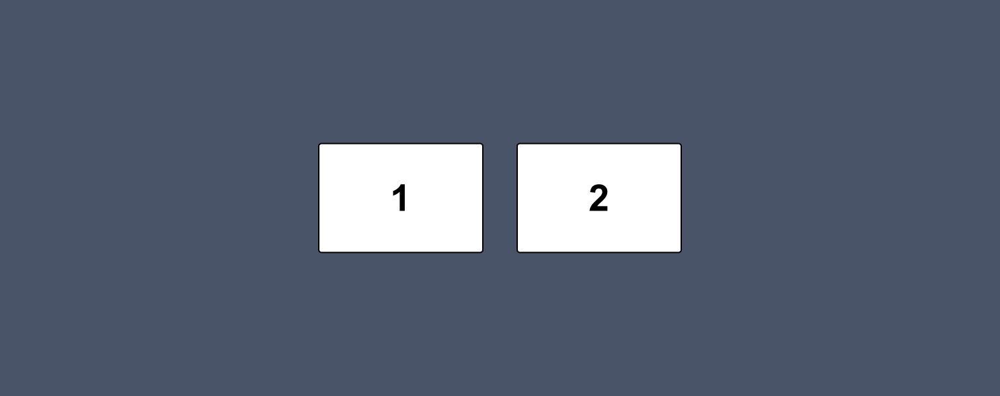
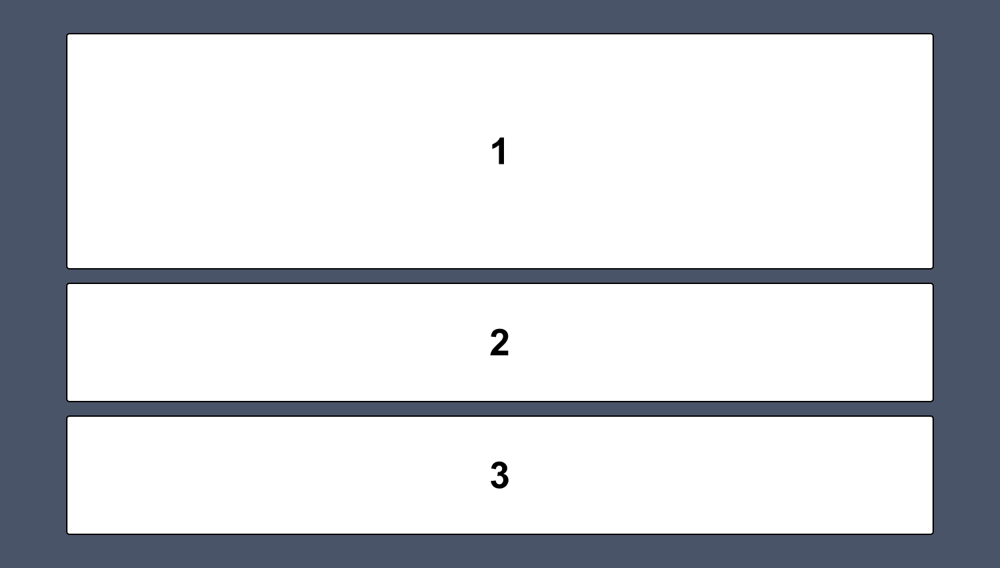
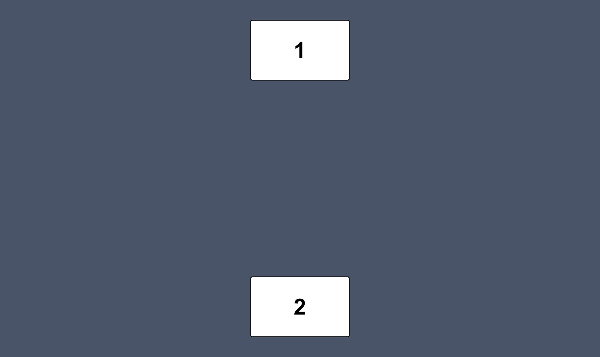

# Week 4 - Mini-oefeningen - Flexbox

 

**Inhoudsopgave**
- [Week 4 - Mini-oefeningen - Flexbox](#week-4---mini-oefeningen---flexbox)
  - [Inleiding](#inleiding)
  - [Mini-oefening 1](#mini-oefening-1)
  - [Mini-oefening 2](#mini-oefening-2)
  - [Mini-oefening 3](#mini-oefening-3)
  - [Mini-oefening 4](#mini-oefening-4)
  - [Mini-oefening 5](#mini-oefening-5)
  - [Mini-oefening 6](#mini-oefening-6)

   

## Inleiding
Voltooi onderstaande mini-oefeningen. Voor iedere oefening is er al code klaargezet die jij moet afronden. Let erop dat deze oefeningen alleen over CSS gaan. Dus je mag het HTML-bestand wel bekijken, maar schrijf alleen maar code in het CSS-bestand.

 

**Hulpbronnen voor de mini-oefeningen**

- [A Complete Guide to Flexbox](https://css-tricks.com/snippets/css/a-guide-to-flexbox/)
- [Flexbox cheatsheet](../../images/css-flexbox-poster.png) 
- [Video waarin flex-grow, flex-shrink en flex-basis wordt uitgelegd](https://www.youtube.com/watch?v=CFgeJq4l1YM)

   

## Mini-oefening 1

Bouw het volgende ontwerp na *(klik op de afbeelding om te vergroten)*:

   

## Mini-oefening 2

Bouw het volgende ontwerp na *(klik op de afbeelding om te vergroten)*:

   

## Mini-oefening 3

Bouw het volgende ontwerp na *(klik op de afbeelding om te vergroten)*:

   

## Mini-oefening 4

Bouw het volgende ontwerp na *(klik op de afbeelding om te vergroten)*:

   

## Mini-oefening 5

Bouw het volgende ontwerp na *(klik op de afbeelding om te vergroten)*:

   

## Mini-oefening 6

Bouw het volgende ontwerp na *(klik op de afbeelding om te vergroten)*:

 

[Terug naar hoofdpagina](../..)
