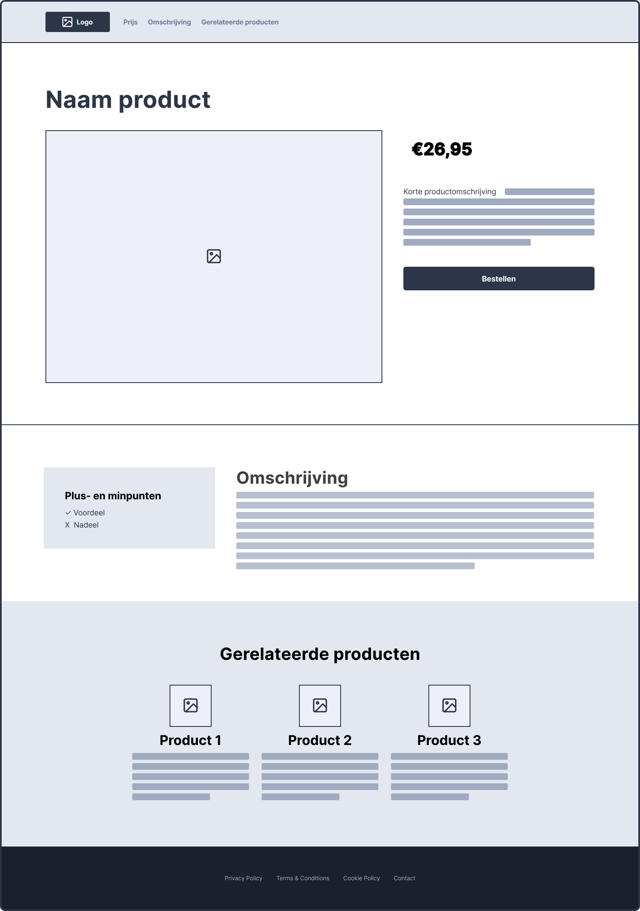

# Week 4 - Donderdag

**Inhoudsopgave**
- [Week 4 - Donderdag](#week-4---donderdag)
  - [De tussenopdracht](#de-tussenopdracht)
  - [Google Fonts](#google-fonts)
  - [Stap 1: Nieuw project aanmaken](#stap-1-nieuw-project-aanmaken)
  - [Stap 2: GitHub gereed maken](#stap-2-github-gereed-maken)
  - [Stap 3: Wireframe nabouwen](#stap-3-wireframe-nabouwen)
    - [Van wireframe naar ontwerp](#van-wireframe-naar-ontwerp)

## De tussenopdracht

De informatie over de opdracht, het inleveren en de voorwaarden zijn te vinden in de ***cursushandleiding***.

 

## Google Fonts

Doorloop de volgende stappen om een font van Google te gebruiken:

1. Ga naar [https://fonts.google.com/](https://fonts.google.com/);
2. Vind de font die je wilt gebruiken en klik erop;
3. Scroll naar de verschillende fontstijlen die beschikbaar zijn en klik rechts op het plusje bij de fontstijlen die je wilt gebruiken (klik ze niet zomaar allemaal aan, want hoe meer je er kiest, hoe langer het duurt om jouw pagina te laden);
4. Klik rechts bovenin op het winkelmandje, selecteer de optie `@import` en kopieer de code die daar staat (zonder de `<style>` tag) en plak deze bovenin jouw CSS-bestand;
5. Scroll in het winkelmandje nog iets verder naar het kopje `CSS rules to specify families` en kopieer de benodigde CSS-code en plak deze bij de gewenste selector in je CSS-bestand.

 

## Stap 1: Nieuw project aanmaken
Je hebt in les 1 al een project aangemaakt waarin je alle lesopdrachten maakt. Deze map heb je waarschijnlijk `frontend-development` genoemd. De tussenopdracht waar je vandaag aan gaat beginnen moet je zien als een los project en moet dus ook in een eigen map. Je kan hiervoor [opdracht 1c van les 1](../week3-dinsdag/#opdracht-1c---eerste-project-aanmaken) volgen, maar noem de map die je aanmaakt dan `frontend-tussenopdracht`. Zet vervolgens de standaard bestandsstructuur neer (zoals uitgelegd wordt in [opdracht 1d van les 1](../week3-dinsdag/#opdracht-1d---bestandsstructuur-html-en-css)).

 

## Stap 2: GitHub gereed maken

- Maak een account op [github.com](https://www.github.com). Dit account ga je de rest van je studieloopbaan (en daarna) gebruiken;
- Maak een `repository` aan voor de tussenopdracht;
  - Voer `repository name` in (*bv. frontend-tussenopdracht*);
  - Zorg ervoor dat `Public` is aangevinkt;
  - De overige velden kan je voor nu ongewijzigd laten en klik op `Create repository`;
- Klik op `uploading an existing file` en upload de bestandsstructuur die je in stap 1 hebt aangemaakt. Klik vervolgens op `Commit changes`;
  - ⚠️ Let op: sleep de inhoud van de map `frontend-tussenopdracht` het scherm in om te uploaden, zodat de mappenstructuur behouden blijft;
- Activeer Github Pages (Settings -> Pages) door onder het kopje **Branch** de optie `main` te selecteren en vervolgens op `Save` te klikken;
- Refresh de instellingenpagina een paar minuten later en dan staat bovenin de link naar jouw website. **Dát is de link die je moet inleveren in [Brightspace](https://brightspace.hr.nl/d2l/le/lessons/28886/topics/169219)**;
  - ⚠️ Let op: doorloop bovenstaande stappen van het uploaden nogmaals vóórdat je het inlevert, zodat de meest recente bestanden online te zien zijn.

 

## Stap 3: Wireframe nabouwen
De opdracht is om onderstaande wireframe na te bouwen, ***zoals omschreven in de cursushandleiding***.
 
### Van wireframe naar ontwerp
- Bedenk waar jouw website over gaat. 
- Gebruik *teksten* en *afbeeldingen* die logisch zijn bij jouw onderwerp.
- Kies zelf bijpassende kleuren. Maak eventueel gebruik van een kleurpalet: [https://coolors.co/palettes/palettes](https://coolors.co/palettes/palettes).
- Kies bijpassende fonts. Tip: gebruik een fancy font voor grote kopteksten, en een prettig leesbaar font voor bodyteksten.
  
 

Hieronder staan nog enkele tips om je hierbij te helpen.

> ### Tips voor het bouwen
>
> - Bouw eerst de basisstructuur op met `semantic` tags;
> - Bouw één voor één de rijen na, in plaats van alles tegelijk op te willen lossen;
> - Gebruik `display:flex` om elementen naast elkaar te zetten;
> - Hou de `flex-documentatie` bij de hand, en gebruik de `flex-inspector` in je browser.
> - Je mag `
` gebruiken om binnen sections containers aan te maken, wanneer je dit puur voor de styling nodig hebt;
> - Gebruik `padding` en `margin` om witruimte toe te voegen rondom je containers en binnen je containers
> - Je kan de hele opdracht oplossen met de stof uit de lessen, je hebt geen google/stackoverflow/chatgpt nodig.
> - Als iets niet lukt kan je je medestudenten, peercoaches en docenten om hulp vragen!

 

[Download: Wireframe tussenopdracht PDF](https://github.com/HR-CMGT/frontend-2023-2024/files/12676336/wireframe-tussenopdracht.pdf)
